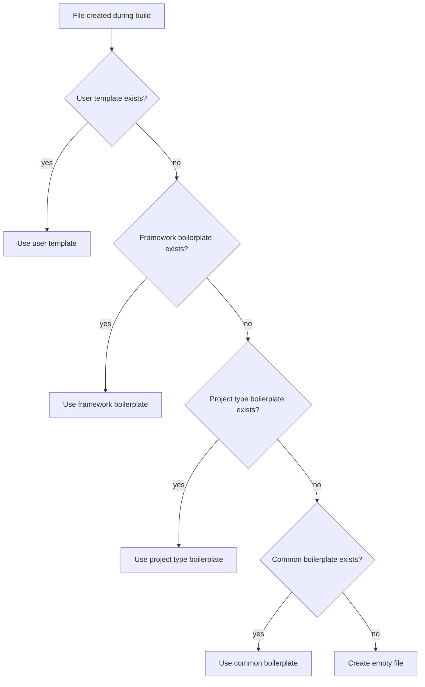

# Templates

UV Forger uses a JSON-based template system to define project structures. Templates live in `uv_forger/config/templates/` and determine which folders, files, and packages are created for each project.

## Template directory layout

```
uv_forger/config/templates/
├── ui_frameworks/        # One JSON per UI framework
│   ├── flet.json
│   ├── pyqt6.json
│   ├── default.json      # Fallback template
│   └── ...
├── project_types/        # One JSON per project type
│   ├── django.json
│   ├── fastapi.json
│   └── ...
└── boilerplate/          # Starter file content
    ├── common/           # Shared across all project types
    │   ├── async_executor.py
    │   └── constants.py
    └── ui_frameworks/    # Framework-specific starter code
        └── flet/
            ├── main.py
            ├── state.py
            └── components.py
```

## Template format

Each template is a JSON file defining a list of `FolderSpec` structures:

```json
[
  {
    "name": "core",
    "create_init": true,
    "root_level": false,
    "subfolders": [],
    "files": ["state.py", "models.py"]
  },
  {
    "name": "tests",
    "create_init": true,
    "root_level": true,
    "subfolders": [],
    "files": []
  }
]
```

| Field         | Type    | Description                                               |
| ------------- | ------- | --------------------------------------------------------- |
| `name`        | string  | Folder name                                               |
| `create_init` | boolean | Whether to create `__init__.py` in this folder            |
| `root_level`  | boolean | `true` = created at project root, `false` = inside `app/` |
| `subfolders`  | array   | Nested `FolderSpec` objects                               |
| `files`       | array   | Filenames to create in this folder                        |

## Loading fallback chain

When you select a UI framework, templates are loaded in this order:

1. **Framework-specific template** — e.g., `ui_frameworks/flet.json`
2. **Default template** — `ui_frameworks/default.json`
3. **Hardcoded defaults** — `DEFAULT_FOLDERS` in `constants.py`

The first one found is used. Project type templates follow the same pattern with their own directory.

## Template merging

When you select **both** a UI framework and a project type, UV Forger merges their templates:

- **Matching folders** (same name) are merged recursively — files are unioned, `create_init` and `root_level` are OR'd, subfolders are merged the same way
- **Unmatched folders** from both templates are included as-is
- The UI framework template takes priority for ordering

This means selecting "Flet" + "FastAPI" gives you a project with the folder structures from both, intelligently combined rather than duplicated.

## Smart scaffolding (boilerplate)

When files are created during a build, UV Forger looks for starter content instead of creating empty files. The lookup follows a fallback chain:



1. **[User templates](#user-templates)** — persistent custom content saved from the file editor (highest priority)
2. `boilerplate/ui_frameworks/{framework}/{filename}` — framework-specific (e.g., Flet's `main.py`)
3. `boilerplate/project_types/{project_type}/{filename}` — project-type-specific
4. `boilerplate/common/{filename}` — shared utilities
5. Empty file — if no boilerplate exists (zero breakage risk)

Boilerplate files can use `{{project_name}}` as a placeholder. At build time, it's replaced with a title-case version of the project name (e.g., `my_app` becomes `My App`).

User templates are stored in the platform data directory by default (e.g., `~/.config/UV Forger/templates/boilerplate/` on Linux) or at a custom path configured in [Settings](settings.md).

## Import tree structure

Instead of building a folder structure from templates, you can paste a text tree to define a complete project layout. Click the **Import Tree** button in the Folders section toolbar.

### Supported formats

- **Box-drawing trees** — the `├──`, `└──`, `│` format from `tree` command output or GitHub READMEs
- **Plain indentation** — spaces or tabs to indicate nesting

### Example

```
my-project/
├── .gitignore
├── pyproject.toml
├── README.md
├── LICENSE
├── CHANGELOG.md
├── docs/
│   ├── index.md
│   └── usage.md
├── src/
│   └── my_project/
│       ├── __init__.py
│       └── app.py
└── tests/
    └── test_app.py
```

### How it works

1. Paste your tree text into the import dialog
2. Click **Preview** to see parsed results (folder count, file count, root file count)
3. Choose **Replace** (replaces current structure) or **Merge** (combines with existing folders)
4. Click **Import** to apply

### Root-level files

Files at the top level of the imported tree (e.g., `LICENSE`, `CHANGELOG.md`, `pyproject.toml`) are displayed individually in the main window folder display — before the folders. They can be selected, edited, and deleted just like files inside folders.

### Overriding UV-generated files

UV normally creates `pyproject.toml`, `README.md`, `.gitignore`, `.python-version`, and `main.py` during `uv init`. When you import a tree that includes these files, they appear in the display but are left as-is during build by default. However, if you **edit their content** (via right-click → Edit Content), your custom content replaces what UV generated — so you can fully customize your `pyproject.toml` or `README.md` before the project is created.

`uv.lock` is also recognized as a UV-generated file and will not be created as an empty file.

### Smart parsing

- Root wrapper folders (e.g., `my-project/`) are automatically stripped
- `__init__.py` entries are converted to `create_init` flags on their parent folders
- Files are deduplicated automatically
- Imported structure state is persisted in project history and presets

### Imported vs standard structure

When a tree is imported, the project is built with a **flat root layout** — all folders are created directly at the project root, with no `app/` wrapper directory. This matches the imported tree exactly.

## File content editing

Right-click any file in the folder tree to open a context menu with four actions:

| Action                  | Description                                                |
| ----------------------- | ---------------------------------------------------------- |
| **Preview Content**     | Read-only view of the file's boilerplate or custom content |
| **Edit Content...**     | Opens a full-screen code editor                            |
| **Import from File...** | Load content from an existing file on disk                 |
| **Reset to Default**    | Remove custom overrides and revert to boilerplate          |

Right-click any folder to see:

| Action                         | Description                                                                   |
| ------------------------------ | ----------------------------------------------------------------------------- |
| **Import Folder from Disk...** | Pick a directory from disk and import it as a subfolder with all its contents |

You can also select a file and click the **Edit File** button (pencil icon) in the Folders section toolbar.

### Browse button (Add File dialog)

When adding a new file via the Add Folder/File dialog, switch the type to "File" to reveal a **Browse...** button. Clicking it opens a file picker — the selected file's name auto-fills the name field (editable) and its content is stored in the project's file overrides. This lets you import an existing file from disk in a single step, instead of adding a blank file and then right-clicking to import.

### Import from Disk (Add Folder dialog)

When adding a new folder via the Add Folder/File dialog (with type set to "Folder"), an **Import from Disk...** button appears. Clicking it opens a directory picker — the selected folder is scanned recursively and its entire structure (subfolders and file contents) is imported into the project template.

The scanner:

- Reads up to **5 levels deep** and **50 files**
- Imports text files with common extensions (`.py`, `.json`, `.yaml`, `.toml`, `.md`, `.html`, `.css`, `.js`, `.ts`, and more)
- Skips hidden directories, `.git`, `__pycache__`, `node_modules`, `.venv`, and other build/cache directories
- Skips binary and non-UTF-8 files silently

After scanning, a summary line shows how many folders, files, and skipped items were found. The folder name auto-fills from the picked directory but is editable before adding.

### Import Folder via right-click

Right-click any folder in the project tree to see an **Import Folder from Disk...** context menu item. This uses the same scanning logic as the Add Folder dialog but imports the directory directly as a subfolder of the clicked folder — no dialog needed.

Both methods store all imported file contents in the project's file overrides, so the content will be written into the built project instead of using boilerplate.

<!-- TODO: screenshot of full-screen editor -->
<!-- { .img-lg } -->

### Editor features

The full-screen editor is powered by [fce-enhanced](https://pypi.org/project/fce-enhanced/) and includes:

- **Syntax highlighting** — Python, JSON, YAML, HTML, CSS, JavaScript, and more (language auto-detected from file extension)
- **Search & replace** — ++cmd+f++ to search, ++cmd+alt+f++ for search & replace
- **Diff pane** — ++cmd+d++ to compare your changes side-by-side with the original
- **Go to line** — ++cmd+g++
- **Command palette** — ++cmd+shift+p++
- **Font zoom** — ++cmd+plus++ / ++cmd+minus++
- **Read-only toggle** — ++cmd+l++

On Windows/Linux, replace ++cmd++ with ++ctrl++.

See [Keyboard Shortcuts](../reference/keyboard-shortcuts.md#file-editor) for the full shortcut list.

### Custom content indicators

Files with custom content (edited or imported) show a **✎** pencil indicator in the folder tree. These overrides take priority over boilerplate during the build and survive template reloads. To persist your customized folder structure and packages for reuse, [save it as a preset](presets.md).

### User templates

When you save from the editor (++cmd+s++), your content is persisted to a user templates directory. These user templates sit at the **top** of the [boilerplate fallback chain](#smart-scaffolding-boilerplate), so they override built-in content for all future projects.

- The default storage location is platform-dependent:
    - `~/Library/Application Support/UV Forger/templates/boilerplate/` on macOS
    - `%LOCALAPPDATA%/UV Forger/` on Windows
    - `~/.config/UV Forger/templates/boilerplate/` on Linux 
- You can **set a custom path** in [Settings](settings.md).

## Adding a new template

### New UI framework

1. Add the framework name to `UI_FRAMEWORKS` in `uv_forger/core/constants.py`
2. Add its package to `FRAMEWORK_PACKAGE_MAP` in the same file
3. Add a display entry to `UI_FRAMEWORK_CATEGORIES` in `uv_forger/ui/dialog_data.py`
4. Create `uv_forger/config/templates/ui_frameworks/<name>.json`
5. Optionally add boilerplate files to `uv_forger/config/templates/boilerplate/ui_frameworks/<name>/`

### New project type

1. Add the type and its packages to `PROJECT_TYPE_PACKAGE_MAP` in `uv_forger/core/constants.py`
2. Add a display entry to `PROJECT_TYPE_CATEGORIES` in `uv_forger/ui/dialog_data.py`
3. Create `uv_forger/config/templates/project_types/<name>.json`
4. Optionally add boilerplate files to `uv_forger/config/templates/boilerplate/project_types/<name>/`

!!! tip
    Adding boilerplate is just dropping files into the right directory — no code changes needed. Look at existing templates for reference.
